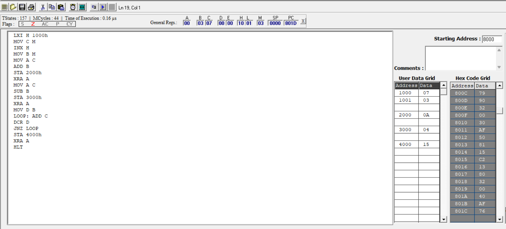

# ⚙️ 8085 MICROPROCESSOR PROGRAM – ARITHMETIC OPERATIONS

---

## 🧠 Overview

This project demonstrates an **8085 Assembly Language Program (ALP)** that performs three fundamental arithmetic operations on two numbers stored in memory:

* ➕ Addition
* ➖ Subtraction
* ✖️ Multiplication (via repeated addition)

The program is designed and tested using an **8085 Simulator**, making it ideal for students learning microprocessor concepts.

---

## 🎯 Objective

Given two numbers stored in memory locations:

* `1000H` → First number
* `1001H` → Second number

The program performs:

| Operation      | Result Stored At |
| -------------- | ---------------- |
| Addition       | `2000H`          |
| Subtraction    | `3000H`          |
| Multiplication | `4000H`          |

---

## 🛠️ Key Concepts Used

* Register operations (`MOV`, `LXI`)
* Arithmetic instructions (`ADD`, `SUB`)
* Looping & iteration (`DCR`, `JNZ`)
* Memory storage (`STA`)
* Logical clearing (`XRA A`)

---

## 📜 Program Logic (Step-by-Step)

1. Load memory address `1000H` into HL pair
2. Move first number → Register C
3. Move second number → Register B
4. Perform:

   * Addition → store at `2000H`
   * Subtraction → store at `3000H`
   * Multiplication using loop → store at `4000H`
5. Halt execution

---

## 💻 Assembly Program

```asm
LXI H 1000h
MOV C M
INX H
MOV B M

MOV A C
ADD B
STA 2000h

XRA A
MOV A C
SUB B
STA 3000h

XRA A
MOV D B

LOOP: ADD C
DCR D
JNZ LOOP

STA 4000h

XRA A
HLT
```

---

## 🔢 Sample Input

| Memory Address | Value |
| -------------- | ----- |
| 1000H          | 07H   |
| 1001H          | 03H   |

---

## 📤 Output

| Operation      | Result | Memory Address |
| -------------- | ------ | -------------- |
| Addition       | 0AH    | 2000H          |
| Subtraction    | 04H    | 3000H          |
| Multiplication | 15H    | 4000H          |

---

## 🧾 Hex Code (Machine Code)

```
8000: 21 00 10
8003: 4E
8004: 23
8005: 46
8006: 79
8007: 80
8008: 32 00 20
800B: AF
800C: 79
800D: 90
800E: 32 00 30
8011: AF
8012: 50
8013: 81
8014: 15
8015: C2 13 80
8018: 32 00 40
801B: AF
801C: 76
```

---

## 📸 Simulator Output



---

## 🚀 How to Run

1. Open your **8085 Simulator**
2. Load the hex code starting at address `8000H`
3. Enter input values at:

   * `1000H`
   * `1001H`
4. Execute the program
5. Check results at:

   * `2000H`
   * `3000H`
   * `4000H`

---

## 🎯 Learning Outcomes

* Understanding **register-level operations**
* Implementing **loops in assembly language**
* Performing arithmetic without direct multiplication instruction
* Memory addressing and data handling in 8085

---

## 🔮 Future Enhancements

* Division operation
* Handling larger numbers (16-bit operations)
* User input integration in simulator
* Flag status analysis

---

## 👨‍💻 Author

**DUDUBOIII**

---

> Master the basics. Build the foundation. ⚡
